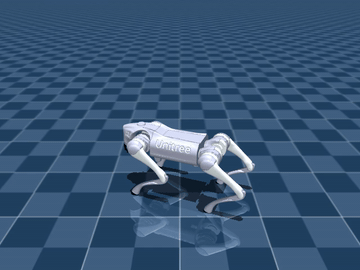

# quadruped_walking

This was originally class project for MIT 6.7960; however, it has now been repurposed for sim-to-real training of a unitree go2 for torque controlled locomotion using Brax for training.

